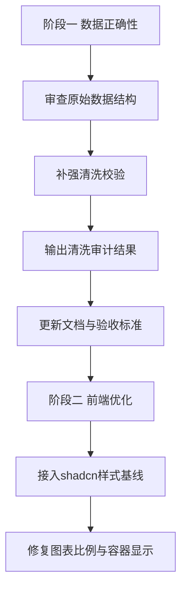

# 数据审查与分阶段实施计划

## 1. 目标

本计划基于当前仓库状态制定，优先保证数据正确性，再进入前端体验优化。

已确认的上下文如下：

- 主数据集为[`data/raw/Telco Customer Churn (IBM)/WA_Fn-UseC_-Telco-Customer-Churn.csv`](data/raw/Telco%20Customer%20Churn%20%28IBM%29/WA_Fn-UseC_-Telco-Customer-Churn.csv)
- 数据集规范与主线选择已记录于[`docs/dataset_selection_and_validation.md`](docs/dataset_selection_and_validation.md)
- 当前清洗逻辑位于[`src/preprocess.py`](src/preprocess.py)
- 当前清洗结果位于[`data/processed/cleaned_churn.csv`](data/processed/cleaned_churn.csv)
- 当前数据概览指标位于[`outputs/tables/dataset_overview.csv`](outputs/tables/dataset_overview.csv)
- 前端图片显示风险点位于[`frontend/src/components/FigureCard.tsx`](frontend/src/components/FigureCard.tsx)与[`frontend/src/app/globals.css`](frontend/src/app/globals.css)

当前已确认的优先级：

1. 第一阶段只做数据集审查、清洗校验与必要文档更新
2. 第一阶段完成后再开始第二阶段前端优化
3. 全阶段任务写入 Markdown 文档

---

## 2. 当前审查结论

### 2.1 数据主线一致性

[`docs/dataset_selection_and_validation.md`](docs/dataset_selection_and_validation.md) 已明确 IBM Telco 数据集为主线数据集，且文档记录的关键事实为：

- 原始数据 7043 行
- 21 列
- `TotalCharges` 存在 11 个空白值
- 清洗后应移除这部分不可用记录

### 2.2 当前清洗逻辑结论

根据[`src/preprocess.py`](src/preprocess.py) 当前实现：

- 对 `TotalCharges` 执行空白字符串标准化
- 将 `TotalCharges` 转为数值型，非法值转为缺失
- 将目标列 `Churn` 从 `Yes` `No` 映射为 `1` `0`
- 删除 `TotalCharges` 或 `Churn` 缺失的记录
- 输出清洗结果到[`data/processed/cleaned_churn.csv`](data/processed/cleaned_churn.csv)

### 2.3 当前数据结果一致性

[`outputs/tables/dataset_overview.csv`](outputs/tables/dataset_overview.csv) 记录：

- `row_count = 7032`
- `column_count = 21`
- `churn_rate ≈ 0.2658`

这与 7043 行原始数据减去 11 条 `TotalCharges` 空白记录的预期一致，说明当前主清洗逻辑与已生成概览结果基本对齐。

### 2.4 已发现的风险

虽然主结果一致，但当前仍需补强以下校验能力：

- 缺少对原始数据 schema 的显式校验，无法快速发现列缺失或列名漂移
- 缺少对主键 `customerID` 唯一性的自动检查
- 缺少对目标列取值域的显式断言
- 缺少对 `TotalCharges` 缺失清洗数量的自动验证输出
- 缺少清洗前后统计摘要的稳定落盘，难以做回归审查
- README 与文档中若未明确说明清洗验收标准，后续实现可能出现偏移

---

## 3. 分阶段实施策略

---

## 4. 第一阶段实施计划

### 4.1 阶段目标

确保[`src/preprocess.py`](src/preprocess.py) 的数据清洗过程可审计、可验证、可复现，并让仓库文档明确写出数据验收标准。

### 4.2 具体执行项

#### 任务 1：建立原始数据结构校验基线

涉及文件：

- [`src/preprocess.py`](src/preprocess.py)
- 必要时新增数据校验输出文件到[`outputs/tables/`](outputs/tables/)

执行内容：

- 校验原始列集合是否符合 IBM Telco 预期 schema
- 明确关键字段必须存在：`customerID` `Churn` `TotalCharges`
- 对列数进行显式检查，避免静默漂移
- 若存在异常列或缺失列，抛出可读错误

验收标准：

- 运行清洗脚本时，若 schema 偏移可立即失败并给出定位信息
- 正常数据下不会影响现有主流程输出

#### 任务 2：补强关键字段质量断言

涉及文件：

- [`src/preprocess.py`](src/preprocess.py)

执行内容：

- 校验[`customerID`](src/preprocess.py:13) 非空且唯一
- 校验原始[`Churn`](src/preprocess.py:12) 仅包含 `Yes` `No` 或允许的缺失形式
- 校验[`TotalCharges`](src/preprocess.py:14) 清洗后为数值型
- 记录空白值转缺失前后的数量变化

验收标准：

- 出现重复主键、异常标签或无法解释的数值污染时，脚本能给出清晰失败原因
- 校验结果可被后续文档引用

#### 任务 3：输出稳定的清洗审计摘要

涉及文件：

- [`src/preprocess.py`](src/preprocess.py)
- [`outputs/tables/dataset_overview.csv`](outputs/tables/dataset_overview.csv)
- 可新增例如[`outputs/tables/data_cleaning_audit.csv`](outputs/tables/data_cleaning_audit.csv)

执行内容：

- 在当前概览指标之外，增加审计型摘要输出
- 建议记录：原始行数、清洗后行数、删除行数、`TotalCharges` 空白数、目标列异常值数、主键重复数
- 保证字段命名稳定，便于文档和前端后续引用

验收标准：

- 每次清洗执行后都能得到可比对的摘要文件
- 审计摘要能解释为何输出为 7032 行

#### 任务 4：复核清洗后数据与下游契约一致性

涉及文件：

- [`data/processed/cleaned_churn.csv`](data/processed/cleaned_churn.csv)
- [`src/run_pipeline.py`](src/run_pipeline.py)
- [`README.md`](README.md)
- [`docs/dataset_selection_and_validation.md`](docs/dataset_selection_and_validation.md)

执行内容：

- 确认下游训练与评估仍基于清洗后的 21 列数据结构
- 确认目标列编码后的含义在文档中表达一致
- 确认 README 中的数据说明、运行方式、输出说明与实际实现一致

验收标准：

- 不引入建模逻辑变更
- 不破坏现有产物路径契约
- 文档中的数据口径与实际脚本完全对齐

#### 任务 5：补充仓库文档中的数据验收规范

涉及文件：

- [`README.md`](README.md)
- [`docs/dataset_selection_and_validation.md`](docs/dataset_selection_and_validation.md)
- 如有必要可新增[`docs/data_cleaning_validation.md`](docs/data_cleaning_validation.md)

执行内容：

- 写明原始数据版本与路径
- 写明清洗规则
- 写明删除记录的原因与数量预期
- 写明清洗通过的判定条件
- 写明输出文件与其用途

验收标准：

- 新成员仅阅读文档即可理解清洗规则与校验口径
- 后续代码模式可据此直接实现而不再反复确认范围

### 4.3 第一阶段边界

第一阶段明确不做：

- 不修改模型训练策略
- 不修改特征工程方向
- 不切换主数据集
- 不进行 shadcn 组件迁移
- 不处理前端图片变形问题

---

## 5. 第二阶段实施计划

### 5.1 阶段目标

在第一阶段数据正确性稳定后，再优化[`frontend/`](frontend/) 的展示层质量，重点提升一致性、可维护性与视觉稳定性。

### 5.2 具体执行项

#### 任务 1：建立 shadcn UI 改造范围

涉及文件：

- [`frontend/package.json`](frontend/package.json)
- [`frontend/src/app/layout.tsx`](frontend/src/app/layout.tsx)
- [`frontend/src/app/globals.css`](frontend/src/app/globals.css)
- [`frontend/src/components/`](frontend/src/components/)

执行内容：

- 明确只替换展示层通用容器、卡片、表格、标签等 UI 基元
- 保持数据读取逻辑不变
- 不改动 Python 产物契约

#### 任务 2：修复图表图片变形

涉及文件：

- [`frontend/src/components/FigureCard.tsx`](frontend/src/components/FigureCard.tsx)
- [`frontend/src/app/globals.css`](frontend/src/app/globals.css)
- 可能涉及使用页面如[`frontend/src/app/page.tsx`](frontend/src/app/page.tsx)

执行内容：

- 调整[`Image`](frontend/src/components/FigureCard.tsx:17) 的尺寸策略，避免固定宽高导致失真
- 调整 `.visual-card` 容器与图片样式，确保保持原始宽高比
- 对不同页面中的图表卡片进行统一约束

验收标准：

- 图表在桌面端与窄屏下都不拉伸、不压扁
- 图表容器高度变化合理，保持可读性

#### 任务 3：统一前端组件样式层级

涉及文件：

- [`frontend/src/components/MetricCard.tsx`](frontend/src/components/MetricCard.tsx)
- [`frontend/src/components/DataTable.tsx`](frontend/src/components/DataTable.tsx)
- [`frontend/src/components/FigureCard.tsx`](frontend/src/components/FigureCard.tsx)
- [`frontend/src/components/RetentionExplorer.tsx`](frontend/src/components/RetentionExplorer.tsx)

执行内容：

- 统一卡片、表格、交互组件视觉语义
- 收敛自定义样式，优先使用 shadcn 风格体系
- 提升页面一致性与后续维护性

### 5.3 第二阶段边界

第二阶段只处理前端展示质量，不改变：

- 数据清洗规则
- 数据输出结构
- 模型结果口径
- Python 管线的主流程逻辑

---

## 6. 推荐执行顺序

1. 先在[`💻 Code` mode](frontend/package.json)落实第一阶段的数据校验增强与文档更新
2. 运行清洗流程并核对[`data/processed/cleaned_churn.csv`](data/processed/cleaned_churn.csv)及[`outputs/tables/dataset_overview.csv`](outputs/tables/dataset_overview.csv)
3. 确认第一阶段验收通过后，再进入第二阶段前端优化
4. 第二阶段再处理 shadcn 引入与图片显示修复

---

## 7. 建议的执行清单

### 第一阶段

- [ ] 为[`src/preprocess.py`](src/preprocess.py) 增加 schema 校验
- [ ] 为[`src/preprocess.py`](src/preprocess.py) 增加主键唯一性与目标值域校验
- [ ] 为[`src/preprocess.py`](src/preprocess.py) 增加清洗审计摘要输出
- [ ] 复核[`data/processed/cleaned_churn.csv`](data/processed/cleaned_churn.csv) 与[`outputs/tables/dataset_overview.csv`](outputs/tables/dataset_overview.csv) 一致性
- [ ] 更新[`README.md`](README.md) 与相关数据文档，写清验收规则

### 第二阶段

- [ ] 为[`frontend/`](frontend/) 明确 shadcn 改造基线
- [ ] 修复[`frontend/src/components/FigureCard.tsx`](frontend/src/components/FigureCard.tsx) 的图像比例策略
- [ ] 调整[`frontend/src/app/globals.css`](frontend/src/app/globals.css) 中图表卡片样式，消除变形
- [ ] 统一关键页面的视觉组件结构

---

## 8. 当前建议

当前最合理的下一步，是切换到[`💻 Code` mode](frontend/package.json)执行第一阶段，仅实现数据审查增强、清洗校验补强与必要文档更新，不进入前端改造。