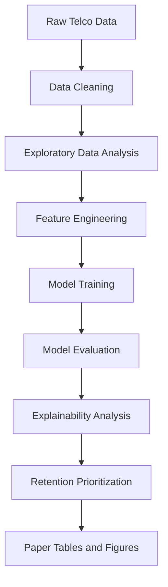
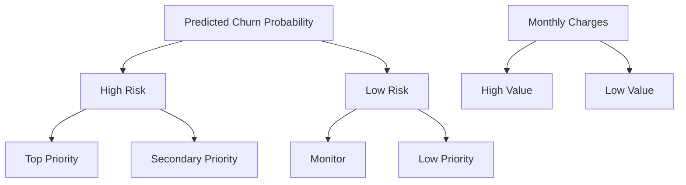

# Explainable Churn Prediction and Retention Prioritization 项目完整方案

## 1. 项目最终定位

**论文题目**  
Explainable Churn Prediction and Retention Prioritization for Subscription-Based Service Providers

**项目目标**  
构建一个兼具预测能力、业务解释能力与行动优先级支持能力的客户流失分析方案，用于帮助订阅制服务企业识别高风险客户、解释流失原因，并将有限保留资源优先投入最值得干预的客户群体。

**最终交付物**
- 流失预测模型比较与最优模型
- 全局可解释性与局部可解释性分析
- 客户保留优先级评分与分层机制
- 可直接写入论文的方法、结果、图表与附录材料
- 可复现的 notebook 与脚本化分析流程

---

## 2. 研究价值重构

你的原始草案方向是正确的，但如果要进一步优化到论文级与实施级兼容，需要把项目从 单纯做 churn classification 升级为 三层结构：

1. **Prediction layer**  
   解决谁会流失
2. **Explanation layer**  
   解释为什么会流失
3. **Action layer**  
   指导企业先挽留谁

这三层结构能让题目中的 Explainable 与 Retention Prioritization 都真正落地，而不是只停留在模型比较层面。

---

## 3. 最终研究对象与数据方案

### 3.1 主数据集
**IBM Telco Customer Churn dataset**

### 3.2 选择理由
- 属于典型订阅制服务场景
- 自带明确标签 [`Churn`](plans/final_execution_plan.md:32)
- 字段结构完整，适合 EDA、建模、解释与业务转化
- 是学术与教学中高频使用的数据集，文献对照容易写
- 很适合用 [`SHAP`](plans/final_execution_plan.md:34) 做解释分析
- 很适合构建 retention prioritization 业务层

### 3.3 核心变量
建议在论文与实施中重点围绕以下字段构建叙述：
- customerID
- gender
- SeniorCitizen
- Partner
- Dependents
- tenure
- PhoneService
- InternetService
- Contract
- PaymentMethod
- MonthlyCharges
- TotalCharges
- Churn

### 3.4 目标变量
- **预测目标**：[`Churn`](plans/final_execution_plan.md:49) 二分类
- 建议编码：Yes = 1，No = 0

### 3.5 业务价值代理变量
由于原数据集没有真实利润、CLV 或补贴成本字段，建议使用以下策略：
- 主业务价值代理：[`MonthlyCharges`](plans/final_execution_plan.md:55)
- 辅助参考变量：[`TotalCharges`](plans/final_execution_plan.md:56)、[`tenure`](plans/final_execution_plan.md:56)

这使论文在业务层面更容易自圆其说：你并不是声称精确衡量客户终身价值，而是使用可观察收入代理变量进行 retention prioritization。

---

## 4. 深度优化后的研究问题

建议固定为以下三个，足够完整且边界清晰：

1. **Which customer characteristics and service-related factors are the strongest predictors of churn in subscription-based services?**
2. **Which machine learning model among Logistic Regression, Random Forest, and XGBoost provides the best churn prediction performance?**
3. **How can predicted churn probability and customer value proxy be combined to prioritize customer retention efforts?**

### 4.1 对应关系
- RQ1 对应 EDA + 特征解释
- RQ2 对应模型比较与评估
- RQ3 对应保留优先级评分机制

这样的设计很适合论文结构，避免研究问题过多导致主线分散。

---

## 5. 优化后的研究目标

1. 识别订阅制服务中与客户流失最相关的特征
2. 构建并比较三个机器学习模型的流失预测表现
3. 通过可解释性分析提升模型结果的业务可理解性
4. 将流失概率与客户价值代理变量结合，构建客户保留优先级框架
5. 输出可直接支持管理决策的分层客户名单与可视化结果

---

## 6. 最终方法设计

## 6.1 总体方法框架


该框架比原方案更完整，因为它把结果写作产出 [`Paper Tables and Figures`](plans/final_execution_plan.md:91) 作为正式终点，而不仅仅是建模结束。

---

## 6.2 数据预处理方案

### 必做步骤
1. 检查 [`TotalCharges`](plans/final_execution_plan.md:97) 中的空字符串
2. 将 [`TotalCharges`](plans/final_execution_plan.md:98) 转换为数值型
3. 删除或处理极少量缺失记录
4. 将 [`Churn`](plans/final_execution_plan.md:100) 转换为 0/1
5. 删除 [`customerID`](plans/final_execution_plan.md:101) 作为建模输入
6. 对类别变量做 one-hot encoding
7. 对训练集与测试集做一致的特征处理
8. 对 [`Logistic Regression`](plans/final_execution_plan.md:104) 管道加入标准化

### 推荐补充步骤
9. 检查类别不平衡程度
10. 比较是否启用 stratified split
11. 记录清洗前后样本数变化
12. 保留一份 [`cleaned_churn.csv`](plans/final_execution_plan.md:109)

### 论文写法强化点
在方法部分要强调：
- [`TotalCharges`](plans/final_execution_plan.md:114) 的空值并非随机技术缺失，而常常与新用户或未形成累计收费有关
- 编码与标准化是为了保证模型可比较性，而非纯粹工程处理

---

## 6.3 EDA 方案

### 描述性分析
- 样本量
- churn rate
- 数值变量分布
- 类别变量构成

### 重点图表
1. churn class distribution
2. tenure distribution by churn
3. contract type vs churn rate
4. monthly charges vs churn
5. total charges vs churn
6. payment method vs churn
7. internet service vs churn
8. correlation heatmap for numeric variables

### EDA 的论文作用
EDA 不只是展示数据，而是为后续模型解释建立叙事逻辑：
- 短 tenure 用户是否更容易流失
- month-to-month 合同是否更脆弱
- 高月费客户是否更容易流失
- 某些付款方式是否与 churn 风险更高相关

---

## 6.4 建模方案

只保留三类模型，这个决策非常正确，因为足够体现方法层次且不会过度扩张。

### Model 1: Logistic Regression
**定位**
- baseline model
- 可解释性强
- 学术写作中必备

**用途**
- 提供线性方向判断
- 输出系数用于初步解释变量方向

### Model 2: Random Forest
**定位**
- 稳定、鲁棒
- 非线性能力较强
- 适合与 Logistic Regression 对比

**用途**
- 输出基于树模型的特征重要性
- 检验复杂关系是否优于线性模型

### Model 3: XGBoost
**定位**
- 最终主模型候选
- 往往有最佳性能
- 与 [`SHAP`](plans/final_execution_plan.md:157) 配合最自然

**用途**
- 作为最优性能模型进行最终解释与优先级输出

### 建模原则
- 固定随机种子
- 使用 stratified train test split
- 使用统一评估指标
- 不在测试集上调参
- 若需要调参，使用交叉验证仅在训练集执行

---

## 6.5 评估设计

### 核心指标
- ROC-AUC
- F1-score
- Recall
- Precision
- Confusion Matrix

### 主指标建议
**Recall + ROC-AUC**

### 理由
在 churn 场景中，漏掉真正会流失的客户通常比误报一个可能流失但实际未流失的客户更贵。因此：
- [`Recall`](plans/final_execution_plan.md:175) 体现找回高风险客户的能力
- [`ROC-AUC`](plans/final_execution_plan.md:176) 体现模型整体排序能力

### 评估强化建议
在论文中增加以下说明：
- 准确率不应作为主指标，因为类别分布可能不平衡
- 如果业务要做定向保留，排序质量比单纯分类正确率更重要
- 可补充 top-decile capture 或 top-k risk review 作为业务解读指标

---

## 6.6 可解释性方案

建议采用 两层解释结构，这是本项目的核心增值点。

### A. 全局解释
适合回答 哪些因素总体上最重要。

包括：
- [`Logistic Regression`](plans/final_execution_plan.md:188) 系数分析
- [`Random Forest`](plans/final_execution_plan.md:189) 特征重要性
- [`XGBoost`](plans/final_execution_plan.md:190) 特征重要性
- [`SHAP summary plot`](plans/final_execution_plan.md:191)

### B. 局部解释
适合回答 单个客户为什么被判定为高风险。

包括：
- [`SHAP waterfall plot`](plans/final_execution_plan.md:196)
- [`SHAP force plot`](plans/final_execution_plan.md:197)
- 1 到 3 个典型高风险客户案例解释

### 推荐写法
你最终论文里不要只说 model is interpretable，而要明确区分：
- global interpretability for strategic understanding
- local interpretability for customer-level intervention

这样会显得研究设计成熟很多。

---

## 6.7 Retention Prioritization 方案

这是题目中最重要的 business layer，必须从预测后处理升级为正式方法模块。

### 基础评分公式
`PriorityScore = ChurnProbability × MonthlyCharges`

### 解释
- [`ChurnProbability`](plans/final_execution_plan.md:211) 代表流失风险
- [`MonthlyCharges`](plans/final_execution_plan.md:212) 代表价值代理
- 两者相乘代表 高风险且高价值 客户应获得更高保留优先级

### 可选增强版
`PriorityScore = ChurnProbability × MonthlyCharges × ValueWeight`

但建议第一版作为主方案，增强版只作为讨论部分的未来优化方向。

### 客户分层规则
建议使用二维矩阵：



### 分层定义建议
可用中位数或分位数切分：
- High Risk: churn probability 高于第 75 百分位
- High Value: monthly charges 高于中位数或第 60 百分位

### 最终输出字段
- customerID
- churn_probability
- monthly_charges
- priority_score
- risk_segment
- value_segment
- priority_level

### 业务解释模板
- **Top Priority**：高流失风险且高价值，应优先干预
- **Secondary Priority**：高流失风险但价值较低，可使用低成本策略挽留
- **Monitor**：当前风险较低但价值较高，建议持续跟踪
- **Low Priority**：风险低且价值低，暂不优先投入资源

---

## 7. 论文级方法章节映射

### Chapter 1 Introduction
包含：
- churn 问题背景
- 订阅制业务中的流失成本
- explainability 与 retention prioritization 的必要性
- 研究问题
- 研究目标
- 研究范围

### Chapter 2 Literature Review
建议围绕四块：
1. customer churn prediction
2. machine learning in CRM analytics
3. explainable AI in business analytics
4. customer retention prioritization and value-based intervention

### Chapter 3 Methodology
包含：
- 数据集介绍
- 数据预处理
- EDA 方法
- 模型定义
- 评估指标
- 可解释性方法
- retention prioritization 设计

### Chapter 4 Results and Findings
包含：
- 数据特征发现
- 模型表现对比
- 最优模型说明
- 关键特征解释
- 个体客户解释
- 优先级排序结果

### Chapter 5 Discussion and Conclusion
包含：
- 主要发现的业务意义
- 为何某些客户更容易流失
- 企业如何根据优先级采取行动
- 局限性与未来研究

---

## 8. 工程实施蓝图

## 8.1 最终目录结构
```bash
churn_prediction/
├── data/
│   ├── raw/
│   │   └── telco_churn.csv
│   └── processed/
│       └── cleaned_churn.csv
├── notebooks/
│   ├── 01_cleaning.ipynb
│   ├── 02_eda.ipynb
│   ├── 03_modeling.ipynb
│   └── 04_explainability_retention.ipynb
├── outputs/
│   ├── figures/
│   ├── tables/
│   └── models/
├── src/
│   ├── preprocess.py
│   ├── train.py
│   ├── evaluate.py
│   └── prioritize.py
├── plans/
│   └── final_execution_plan.md
├── requirements.txt
├── README.md
└── .gitignore
```

---

## 8.2 每个 notebook 的职责

### [`01_cleaning.ipynb`](notebooks/01_cleaning.ipynb)
输出：
- 数据读取
- 字段检查
- 缺失与类型修正
- 编码前清洗
- 导出 [`cleaned_churn.csv`](data/processed/cleaned_churn.csv)

### [`02_eda.ipynb`](notebooks/02_eda.ipynb)
输出：
- 描述统计
- 类别变量分析
- 数值变量分析
- 关键可视化
- 初步业务洞察

### [`03_modeling.ipynb`](notebooks/03_modeling.ipynb)
输出：
- 特征工程
- train test split
- 三模型训练
- 性能比较表
- confusion matrix
- ROC curve
- 最优模型保存

### [`04_explainability_retention.ipynb`](notebooks/04_explainability_retention.ipynb)
输出：
- feature importance
- SHAP summary
- SHAP local cases
- priority score 计算
- Top 20 retention targets
- segmentation chart
- 导出 [`customer_priority_table.csv`](outputs/tables/customer_priority_table.csv)

---

## 8.3 脚本职责

### [`src/preprocess.py`](src/preprocess.py)
- 数据清洗函数
- 类型转换函数
- 训练前编码准备函数

### [`src/train.py`](src/train.py)
- 模型训练函数
- 可选调参逻辑
- 模型持久化

### [`src/evaluate.py`](src/evaluate.py)
- 指标计算
- confusion matrix
- ROC curve
- performance summary table

### [`src/prioritize.py`](src/prioritize.py)
- churn probability 提取
- priority score 计算
- 风险分层与价值分层
- retention table 输出

---

## 9. 具体执行顺序

## Phase 1 Data Cleaning
**输入**：[`data/raw/telco_churn.csv`](data/raw/telco_churn.csv)  
**输出**：[`data/processed/cleaned_churn.csv`](data/processed/cleaned_churn.csv)

任务：
- 载入原始数据
- 检查字段类型
- 修复 [`TotalCharges`](plans/final_execution_plan.md:324) 空字符串
- 转数值
- 编码 [`Churn`](plans/final_execution_plan.md:326)
- 移除 [`customerID`](plans/final_execution_plan.md:327) 作为建模输入
- 保存清洗结果

## Phase 2 Exploratory Data Analysis
**输出**：[`outputs/figures/`](outputs/figures/) 中的图表

任务：
- 生成描述统计
- 输出 churn rate 图
- 输出 tenure、contract、monthly charges、payment method 等图表
- 形成初步业务洞察文字

## Phase 3 Modeling
**输出**：
- [`outputs/tables/model_performance_comparison.csv`](outputs/tables/model_performance_comparison.csv)
- [`outputs/figures/confusion_matrix_*.png`](outputs/figures/)
- [`outputs/figures/roc_curve_comparison.png`](outputs/figures/roc_curve_comparison.png)
- [`outputs/models/best_model.pkl`](outputs/models/best_model.pkl)

任务：
- 分割训练集测试集
- 训练 [`Logistic Regression`](plans/final_execution_plan.md:343)、[`Random Forest`](plans/final_execution_plan.md:343)、[`XGBoost`](plans/final_execution_plan.md:343)
- 输出评估结果
- 选择最优模型

## Phase 4 Explainability
**输出**：
- 特征重要性图
- [`SHAP summary plot`](plans/final_execution_plan.md:349)
- 1 到 3 个局部解释案例图

任务：
- 提取系数与树模型重要性
- 对最优模型运行 [`SHAP`](plans/final_execution_plan.md:353)
- 解释高风险客户案例

## Phase 5 Retention Prioritization
**输出**：
- [`outputs/tables/customer_priority_table.csv`](outputs/tables/customer_priority_table.csv)
- [`outputs/tables/top_20_retention_targets.csv`](outputs/tables/top_20_retention_targets.csv)
- 客户分层图

任务：
- 提取预测概率
- 计算 [`PriorityScore`](plans/final_execution_plan.md:360)
- 划分优先级层级
- 输出高优先级客户名单

## Phase 6 Paper Packaging
**输出**：
- 可直接写入论文的方法段落
- 可直接放入结果章节的图表表格
- 结果解释要点

任务：
- 为每张图写一句研究发现
- 为每张表写一句业务解释
- 将结果映射到三个研究问题

---

## 10. 图表与表格清单

## 10.1 必做图表
- churn class distribution
- tenure vs churn
- contract type vs churn
- monthly charges vs churn
- payment method vs churn
- correlation heatmap
- confusion matrix for each model
- ROC curve comparison
- feature importance plot
- SHAP summary plot
- customer priority segmentation chart

## 10.2 必做表格
- dataset overview table
- data cleaning summary table
- model performance comparison table
- top predictive features table
- top 20 retention targets table
- priority level distribution table

---

## 11. 论文结果章节的建议叙事顺序

建议结果章节按以下顺序写：

1. 数据概况与 churn 分布
2. EDA 发现的初始流失模式
3. 三模型性能比较
4. 选择最优模型的理由
5. 全局解释结果
6. 局部客户解释案例
7. retention prioritization 结果
8. 对管理实践的意义

这样读者会自然从 数据理解 进入 预测，再进入 解释，最后进入 行动建议。

---

## 12. 风险控制与优化建议

### 12.1 方法风险
- 数据集较经典，创新性容易被质疑
- 数据规模较小，复杂模型优势可能不显著
- [`MonthlyCharges`](plans/final_execution_plan.md:392) 只是价值代理，不是真实利润

### 12.2 应对方式
- 把创新点放在 Explainable + Retention Prioritization 组合，而不是数据集本身
- 强调项目目标是 business decision support，不是追求算法竞赛式性能
- 在讨论部分明确说明 value proxy 的合理性与局限

### 12.3 论文中的创新表达
建议将创新点表述为：
- integrating predictive modeling with explainable analytics
- translating churn prediction into actionable retention prioritization
- bridging model performance and managerial decision support

---

## 13. 最终推荐结论

最终最稳的组合不变，但要升级为完整闭环：

- **数据集**：IBM Telco Customer Churn
- **基线模型**：[`Logistic Regression`](plans/final_execution_plan.md:408)
- **辅助模型**：[`Random Forest`](plans/final_execution_plan.md:409)
- **主模型候选**：[`XGBoost`](plans/final_execution_plan.md:410)
- **解释方法**：[`SHAP`](plans/final_execution_plan.md:411) + 系数分析 + 特征重要性
- **保留策略评分**：`PriorityScore = ChurnProbability × MonthlyCharges`
- **主研究贡献**：预测 + 解释 + 优先级决策三位一体

这个方案已经达到 可直接实施、可直接写论文、可直接准备答辩 的水平。

---

## 14. 下一阶段实施任务清单

进入实现阶段后，建议严格按以下顺序落地：

1. 创建目录结构
2. 创建 [`requirements.txt`](requirements.txt) 与 [`.gitignore`](.gitignore)
3. 创建 4 个 notebook 骨架
4. 放入原始数据 [`data/raw/telco_churn.csv`](data/raw/telco_churn.csv)
5. 实现 [`src/preprocess.py`](src/preprocess.py)
6. 完成清洗 notebook
7. 完成 EDA notebook
8. 实现训练与评估脚本
9. 完成 explainability notebook
10. 实现 retention prioritization 输出
11. 汇总图表与表格
12. 回写论文方法与结果部分

---

## 15. 实施完成后的标准

当以下产物全部存在时，说明项目主干已完成：
- 可运行的 4 个 notebook
- 清洗后的数据文件
- 模型性能表
- 最优模型文件
- SHAP 图
- retention priority 表
- Top 20 客户名单
- 至少 1 版可放进论文的图表集

---

## 16. 给下一模式的执行指令

下一步应在 [`💻 Code`](code) 模式中完成以下内容：
- 建立项目目录
- 生成 [`requirements.txt`](requirements.txt)
- 生成 [`.gitignore`](.gitignore)
- 生成 4 个 notebook 占位骨架
- 生成 [`src/preprocess.py`](src/preprocess.py)、[`src/train.py`](src/train.py)、[`src/evaluate.py`](src/evaluate.py)、[`src/prioritize.py`](src/prioritize.py) 基础模板
- 生成 [`README.md`](README.md) 说明项目运行方式

该计划文件即为后续实现阶段的唯一基线。