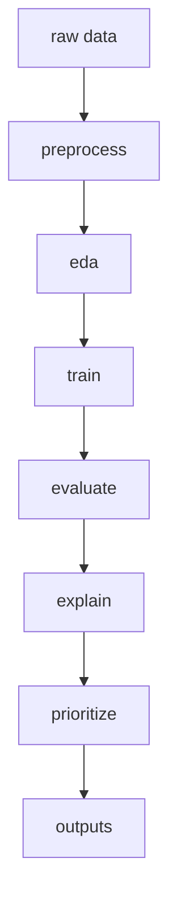

# 当前项目的精简版 skill 抽离与安装计划

## 目标结论

基于当前仓库结构，建议不要直接完整引入外部 [`stack-kit`](https://github.com/codingstu/stack-kit) 的全部能力，而是只在当前项目内抽离一个**本地可复用的最小 skill 模板**，专门服务于现有的机器学习工程流程。

该精简 skill 应聚焦以下固定主线：

1. 数据预处理，对应 [`src/preprocess.py`](src/preprocess.py)
2. 模型训练，对应 [`src/train.py`](src/train.py)
3. 模型评估，对应 [`src/evaluate.py`](src/evaluate.py)
4. 可解释性分析，对应 [`src/explain.py`](src/explain.py)
5. 客户优先级排序，对应 [`src/prioritize.py`](src/prioritize.py)
6. 端到端运行入口，对应 [`src/run_pipeline.py`](src/run_pipeline.py)

## 为什么要精简而不是整包迁入

从 [`README.md`](README.md) 与 [`docs/final_execution_plan.md`](docs/final_execution_plan.md) 可以看出，这个项目的治理边界非常清晰：

- 以纯脚本 pipeline 为主，而不是通用全栈脚手架
- 以 Conda 环境为基线，对应 [`environment.yml`](environment.yml)
- 以固定目录产出为核心，如 [`data/`](data/)、[`outputs/`](outputs/)、[`docs/`](docs/)
- 当前用户已经确认 skill 只保留机器学习工程能力，不保留文档能力

因此外部 skill 若包含以下能力，应全部去掉：

- 前端或全栈初始化能力
- 通用文档生成能力
- 论文写作辅助能力
- 多项目模板拼装能力
- 与当前目录结构无关的工程脚手架能力
- 与当前项目不一致的环境管理约定

## 建议保留的最小 skill 能力集

建议最终只保留 4 组能力。

### 1. 项目感知能力
让 skill 在执行前先识别当前仓库中的关键文件：

- [`README.md`](README.md)
- [`environment.yml`](environment.yml)
- [`src/run_pipeline.py`](src/run_pipeline.py)
- [`src/preprocess.py`](src/preprocess.py)
- [`src/train.py`](src/train.py)
- [`src/evaluate.py`](src/evaluate.py)
- [`src/explain.py`](src/explain.py)
- [`src/prioritize.py`](src/prioritize.py)

目的：让 skill 在输出建议时围绕现有实现，而不是生成偏离仓库结构的通用方案。

### 2. 机器学习 pipeline 操作能力
让 skill 能围绕当前既有流程进行工作：

- 数据路径检查
- 流程入口识别
- 模块间依赖关系识别
- 输出目录一致性检查
- 新增模块时遵循现有脚本风格

建议 skill 内部把主流程理解为：



### 3. 约束遵循能力
skill 需要明确遵循以下项目约束：

- 环境基线以 [`environment.yml`](environment.yml) 为准
- 原始数据默认位于 [`data/raw/`](data/raw/)
- 清洗数据默认位于 [`data/processed/`](data/processed/)
- 图表、表格、模型默认输出到 [`outputs/`](outputs/)
- 不主动引入 notebook-first 工作流
- 不主动引入前端目录
- 不重写现有研究目标与主流程文档

### 4. 扩展实施能力
当后续切到实现模式时，该 skill 可指导执行以下类型的任务：

- 给 [`src/run_pipeline.py`](src/run_pipeline.py) 增加更稳健的阶段控制
- 给 [`src/train.py`](src/train.py) 增加模型配置整理
- 给 [`src/evaluate.py`](src/evaluate.py) 增加统一指标导出
- 给 [`src/explain.py`](src/explain.py) 增加 explainability 输出标准化
- 给 [`src/prioritize.py`](src/prioritize.py) 增加 retention 分层规则
- 补充缺失的数据校验与异常处理

## 建议删除的 stack-kit 能力

如果从外部 [`stack-kit`](https://github.com/codingstu/stack-kit) 抽离内容，建议只保留与任务编排和仓库感知有关的最小部分，其余尽量删除。删除优先级如下：

1. 文档写作类 skill
2. 前端开发类 skill
3. 全栈项目初始化类 skill
4. 与当前项目无关的通用脚手架
5. 复杂的多角色协作模板
6. 非机器学习分析项目的默认提示词

## 本地安装形态建议

建议安装形态不是发布独立包，而是在当前仓库内落地为一个本地 skill 目录或模板文件集合，放在单独目录下进行管理。

推荐结构如下：

```text
.local-skills/
  ml-pipeline-minimal/
    skill.md
    examples.md
    checklist.md
```

其中：

- [`skill.md`](plans/skill_extraction_plan.md) 负责定义该 skill 的目标、输入、边界与默认行为
- [`examples.md`](plans/skill_extraction_plan.md) 负责给出围绕 [`src/run_pipeline.py`](src/run_pipeline.py) 等模块的典型调用示例
- [`checklist.md`](plans/skill_extraction_plan.md) 负责给出实施前检查项，例如数据路径、输出目录、依赖与目标模块

注：这里的文件名是计划占位命名，实施时应创建到真正的本地 skill 目录，而不是写回本计划文件。

## 推荐实施步骤

### 第一步
在当前仓库中创建一个本地 skill 目录，承载精简后的机器学习工程 skill。

### 第二步
从外部 [`stack-kit`](https://github.com/codingstu/stack-kit) 中只抽取以下信息：

- skill 元信息组织方式
- 任务约束写法
- 示例结构写法
- checklist 写法

不要直接迁入其全部模板与角色。

### 第三步
将 skill 内容重写为当前项目专用版本，核心要显式引用以下文件：

- [`src/preprocess.py`](src/preprocess.py)
- [`src/train.py`](src/train.py)
- [`src/evaluate.py`](src/evaluate.py)
- [`src/explain.py`](src/explain.py)
- [`src/prioritize.py`](src/prioritize.py)
- [`src/run_pipeline.py`](src/run_pipeline.py)
- [`environment.yml`](environment.yml)
- [`README.md`](README.md)

### 第四步
把 skill 的默认行为收敛为以下模式：

- 先识别当前 pipeline 阶段
- 再确认目标模块
- 再给出最小必要改动建议
- 避免生成与仓库无关的附加结构

### 第五步
为后续实现准备安装动作，优先是：

- 新建本地 skill 目录
- 写入最小版 [`skill.md`](plans/skill_extraction_plan.md)
- 写入示例与 checklist
- 如有必要，在 [`README.md`](README.md) 增加一段简短说明，指向本地 skill 的用途

## 计划边界

本计划当前**不包含实施**，只定义后续在 [`code`](code) 模式中应完成的安装与抽离方向。

本计划也**不包含**：

- 直接联网拉取外部仓库
- 改写现有 Python 业务逻辑
- 扩展文档写作辅助系统
- 构建独立发布包

## 下一步建议

下一阶段应切换到 [`code`](code) 模式，完成以下实际动作：

1. 创建本地 skill 目录
2. 编写精简版 skill 定义文件
3. 编写最小示例文件与检查清单
4. 如有必要补充一段仓库内使用说明
